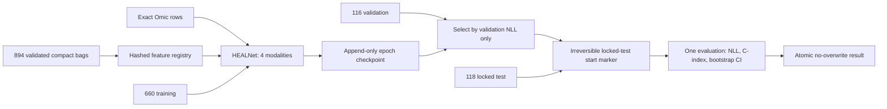

# BRCA HEALNet training package — execution request

Status: **CPU-validated and ready for execution review; training is locked**.

The survival endpoint, one patient-level split, and training-only time bins are
now frozen. The package does not need more scientific pilots. It can train only
after production preprocessing has produced and independently validated the
complete 894-row compact-feature registry.

## Frozen study matrix

| Partition | Patients | Events | Censored |
|---|---:|---:|---:|
| Training | 660 | 79 | 581 |
| Validation | 116 | 14 | 102 |
| Locked test | 118 | 33 | 85 |
| **Total** | **894** | **126** | **768** |

The source-defined endpoint is `survival_months`, with event indicator
`1-censorship`. The four training-event quartiles use training patients only;
the internal cutpoints are **22.505, 44.84, and 67.940 months**. Validation and
test data do not influence them.

## Training architecture

Each patient is streamed independently as WSI `[1,P_i,2048]`, RNA
`[1,1,1558]`, mutation `[1,1,21]`, and CNV `[1,1,1333]`. The pinned HEALNet
BRCA architecture emits four discrete hazard logits. Training uses the official
v0.1.0 NLL semantics, Adam, OneCycleLR, true 16-patient gradient accumulation,
float32, at most 50 epochs, and validation-NLL early stopping with patience 5.
The locked test is evaluated exactly once after checkpoint selection.

Checkpoint identity binds the run UUID, committed project source,
authorization, split, cutpoints, future feature registry, protocol, and pinned
official HEALNet commit. Each completed epoch atomically publishes model,
optimizer, scheduler, Torch CPU/CUDA RNG state, and history. Only the latest
complete contiguous checkpoint can resume. Stranded staging or identity drift
stops without cleanup or overwrite.

The launcher currently has two independent locks: execution is `False`, and
the authorization hash/file is absent. Its first operation is the lock check;
the blocked CLI reaches neither argument parsing nor path, Torch, CUDA, feature,
or model access.

## Remaining gate

Training cannot start after only eight patients. First, the production stream
must create validated compact features for all 894 split members and materialize
their exact hashed registry. Then a separate authorization must bind that
registry, the committed training sources, the run UUID, output roots, one CUDA
device, and the frozen protocol. No GPU is needed until that point.

The study is supervisor-aligned engineering work using ImageNet1K V2 features.
It must not be described as exact paper reproduction because the paper uses a
Kather100K-pretrained encoder.
