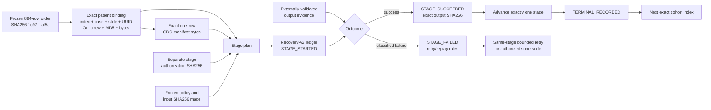

# BRCA 894-patient production control-plane validation

Status: `CPU_SYNTHETICALLY_VERIFIED__LIVE_COHORT_EXECUTION_NOT_AUTHORIZED`

## Executive result

The CPU-only production control plane is implemented and synthetically
validated against the frozen 894-patient TCGA-BRCA singleton order. It binds
each patient transaction to the exact cohort row, one-row GDC manifest, Omic
row, stage authorization, source-policy hashes, stage input/output hashes,
compact feature evidence, and the restart-safe recovery-v2 ledger.

The rehearsal completed the eight pipeline stages for the exact first eight
cohort rows: **8 patients × 8 stages × 2 immutable events = 128 events**. Every
synthetic patient stopped at `TERMINAL_RECORDED` before the next cohort index
was permitted to start. No real patient operation was invoked.

This package is the production **control plane**, not a blanket execution
authorization. It deliberately contains no downloader, OpenSlide, pixel,
coordinate, Torch/CUDA, feature, HEALNet, Drive, deletion, or training call
surface. Live stage implementations remain separately gated.

## Bound architecture

The eight frozen stages are:

1. `PLANNED`
2. `ACQUISITION_AUTHORIZED`
3. `RAW_VERIFIED`
4. `HEADER_POLICY_VERIFIED`
5. `COORDINATES_VERIFIED`
6. `GPU_AUTHORIZED`
7. `FEATURES_VERIFIED`
8. `TERMINAL_RECORDED`

## Exact cohort binding

The adapter securely reads
`reports/brca_row_level_alignment.csv` using a bounded `O_NOFOLLOW` descriptor
and checks the path identity before and after the read. The source SHA256 is
`13b1e8e58b28d4669d8015f759e7d6df3f3296a16f77920b6a83a099999c19fe`.
It retains only `KEEP` rows with
`EXACT_SINGLETON_CASE_AND_SLIDE_MATCH`, sorts by
`(case_id, slide_id, id)`, and reproduces:

- 894 unique patients, slides, and GDC UUIDs;
- 918,532,189,383 declared raw WSI bytes; and
- canonical order SHA256
  `1c97fa4f8305185f2da191f5ebaed603db7d2bdd11c89a580e784ef46655af5a`.

Each row binds cohort index, patient, full slide filename, GDC UUID, Omic
source-row ID, MD5, byte size, and release state. The adapter derives the exact
standard one-row GDC TSV bytes and rejects any byte-level manifest drift.
Future live Omic evidence must rematch the patient, full slide, and frozen
source-row ID before a stage can be recorded as successful.

## Compact artifact gate

`FEATURES_VERIFIED` requires metadata evidence from a prior real compact
artifact validation. The control plane rejects success unless the evidence
binds:

- the same patient, full slide, GDC UUID, and Omic row;
- the exact stage source-policy and input-hash maps;
- the exact four-file compact set;
- the manifest and sidecar hash;
- every retained file hash;
- finite contiguous CPU float32 tensor shape `[P_i,2048]`;
- contiguous 2× then 4× row ranges; and
- row-provenance count equal to `P_i`.

The validation record must itself be the output hash written into the ledger;
an unrecorded validation claim cannot advance the stage.

## Synthetic end-to-end rehearsal

The test creates temporary metadata ledgers only. For each of the first eight
patients it constructs an independent transaction, supplies distinct
authorization and input hashes, records `STAGE_STARTED`, validates the
stage-specific output, records `STAGE_SUCCEEDED`, and replays the chain before
advancing. The feature stage uses synthetic compact evidence; it does not load
or create a tensor.

Adversarial coverage includes alignment hash and symlink rejection, exact
manifest drift, Omic-row mismatch, patient/UUID mismatch, source-policy drift,
malformed compact layout, invalid feature width, wrong branch ranges, and a
static AST check excluding real operation imports and calls.

## Exact first-eight canary proposal

Proposal: `BRCA_894_CANARY_0001_0008`; status:
`PROPOSED_NOT_AUTHORIZED`. These are the first eight rows of the frozen order,
not a hand-picked sample.

| Index | Patient | GDC UUID | Omic row | Raw WSI bytes |
|---:|---|---|---:|---:|
| 1 | TCGA-3C-AALK | 93b26333-5723-4fa4-a4de-6124c04ab243 | 4 | 1,769,848,096 |
| 2 | TCGA-4H-AAAK | fd6a8fe0-50d8-4f69-b678-1a884e1c5d3d | 5 | 1,016,839,805 |
| 3 | TCGA-5L-AAT0 | b3780253-78fe-4907-9f5a-230b2bb4b24e | 6 | 349,684,623 |
| 4 | TCGA-5L-AAT1 | 4eec69ca-381b-4c17-b3e9-49492d71560e | 7 | 592,769,341 |
| 5 | TCGA-5T-A9QA | cfe3c99d-0c00-4360-b768-2cb4fbd1040a | 8 | 2,057,150,279 |
| 6 | TCGA-A1-A0SB | cea82b7d-135a-49d5-b4f6-3fb0215f7188 | 9 | 741,184,858 |
| 7 | TCGA-A1-A0SD | 0a9ea7ac-9d51-4ff7-b40b-659a57e64945 | 10 | 655,624,470 |
| 8 | TCGA-A1-A0SE | 53f1310d-cea9-4179-ad5c-3a257fcc7ed3 | 11 | 1,114,028,148 |
| **Total** | **8 patients** |  |  | **8,297,129,620** |

The machine-readable proposal is
`reports/brca_first_eight_canary_proposal.tsv`, SHA256
`940b8fd1f7d194c2c9b7c69ddae58ffff3c55196b6841ac859c60cbc01095dfd`.
Administrative release size is eight, but runtime concurrency remains exactly
one patient, one download, and one GPU job. The first mismatch stops the
release and no later patient starts.

Based on the conservative Q25/Q50/Q75 planning rates, this canary is estimated
at **20.8–32.7 T4 minutes** and **0.61–1.12 GB** of compact artifacts. These are
planning estimates, not guarantees; downloads, CPU coordinate work, failures,
and retries are excluded. Actual patch counts remain unknown until each
patient completes the header and coordinate stages.

## Raw-WSI lifecycle decision

The current decisions are:

- **B06:** header accepted, `SKIP_B06_PIXEL_WORK`, raw WSI retained, deletion
  prohibited.
- **First-eight canary recommendation:** retain all eight raw WSIs until the
  formal post-canary review. Their exact total is 8.30 GB, so this is practical
  and maximizes re-auditability.
- **Full 894-patient cohort:** retaining all 918.53 GB locally is incompatible
  with the approximately 200 GB workspace quota. A recoverable per-patient
  lifecycle is therefore mandatory before full-cohort execution.

The conservative canary storage preflight is 35,220,592,451 available bytes:

\[
8{,}297{,}129{,}620
+ 2(2{,}057{,}150{,}279)
+ 1{,}117{,}667{,}520
+ 1{,}691{,}494{,}753
+ 20{,}000{,}000{,}000.
\]

This covers all eight raw files, a conservative twice-largest transient
allowance, the upper compact estimate, retained B06, and the 20 GB safety
floor.

For the full cohort, the recommended `SAFE_TO_RELEASE_LOCAL_RAW` gate is:

1. exact raw identity and manifest remain hash-bound;
2. coordinate and compact artifacts have been independently reopened and
   validated;
3. tensor, row-provenance, manifest, and sidecar hashes all pass;
4. the feature stage is terminally recorded with no pending/crash ledger
   state;
5. a verified recovery source or separately approved retained copy exists;
6. the raw lifecycle decision hash is bound to the terminal stage; and
7. a separate patient-specific deletion authorization is present.

No raw file should be released merely because feature extraction returned
successfully. This report proposes the gate but does not authorize deletion.

## Remaining decisions and authorizations

Before the canary can run, the user/supervisor must still:

1. approve or revise the first-eight identities and strict frozen order;
2. approve retaining all eight canary raw WSIs through post-canary review;
3. choose the full-cohort recovery/lifecycle policy;
4. authorize the first-eight acquisition release, still serial and
   patient-specific;
5. after each header is known, authorize its CPU scale/coordinate-policy
   design and then its exact bounded mask read/coordinate publication;
6. after coordinates are verified, authorize each exact ImageNet1K V2 T4
   feature stage and compact publication; and
7. separately approve terminal lifecycle actions. Training remains a later,
   independent protocol authorization.

GPU/CUDA is **not required now**. It is required only at item 6, after the
corresponding patient has verified coordinates and an exact GPU authorization.

## Authorization boundary

During this validation there were zero downloads, WSI/OpenSlide opens, pixel
reads, masks, coordinates, Torch/CUDA calls, feature extractions, HEALNet
executions, Drive operations, raw deletions, cohort-patient executions, or
training runs. B06 remains retained and no B06 pixel work was performed.
