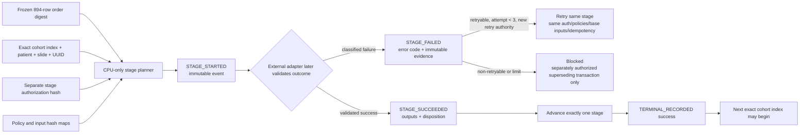

# BRCA 894-patient streaming executor/recovery v2 validation

Status: `CPU_ONLY_CONTRACT_SYNTHETICALLY_VERIFIED__COHORT_EXECUTION_NOT_AUTHORIZED`

## Outcome

The generic one-patient planning and recovery contract now closes the failure,
retry, replay, identity and ledger-integrity gaps identified in the accelerated
readiness review. It is a **non-executable contract**: it plans and records
stage metadata but contains no adapter for GDC, OpenSlide, pixels, coordinate
generation, Torch/CUDA, feature extraction, HEALNet, Drive, deletion or
training.

No cohort patient was processed during this work.

## Architecture

Every patient remains one independent transaction. Each stage attempt has two
hash-chained records: `STAGE_STARTED`, followed by exactly one
`STAGE_SUCCEEDED` or `STAGE_FAILED`. A crash after the start therefore replays
to completion of that same run and attempt; it cannot silently begin another.

## Frozen cohort-order binding

The planner binds the frozen alignment inventory
`reports/brca_row_level_alignment.csv` (SHA256
`13b1e8e58b28d4669d8015f759e7d6df3f3296a16f77920b6a83a099999c19fe`).
Filtering exact singleton `KEEP` rows and sorting by `(case_id, slide_id, id)`
produces 894 rows and the canonical order digest
`1c97fa4f8305185f2da191f5ebaed603db7d2bdd11c89a580e784ef46655af5a`.
The canonical field names and JSON types are frozen in the v2 policy.

This module **binds the digest but does not parse or validate a live cohort
row**. Before any future real stage, a separately reviewed production adapter
must rematch cohort index, patient, slide, GDC UUID, Omic row, MD5 and size
against this frozen order.

## Recovery guarantees

- Fixed transaction identity: cohort index, patient ID, slide ID, GDC UUID and
  transaction UUID cannot drift within a ledger.
- Stage order cannot skip, regress or reopen after terminal success.
- Run IDs cannot be reused across attempts; attempt numbers are deterministic.
- Success advances only after an explicit artifact/hash validation flag and an
  exact output hash map.
- An existing output may only be validated and reused when every expected hash
  matches. Different content is a hard collision; overwrite is never offered.
- Retry is limited to three attempts and only the frozen transient codes are
  retryable. It needs a separate retry-authorization hash and must preserve the
  stage authorization, source-policy hashes, base inputs and idempotency key.
- Non-retryable or exhausted transactions remain blocked. A new transaction
  for the same cohort index/patient/slide/UUID requires a separate supersede
  authorization and explicit binding to the failed event.
- The next patient is blocked until terminal success and must be the next
  cohort index with a distinct patient ID.
- Event timestamps are nondecreasing UTC; records form a canonical SHA256
  chain.

## Ledger publication and crash behavior

Ledger publication uses a sibling staging file created exclusively, file
`fsync`, an atomic no-overwrite hard link to the final numbered JSON path,
staging cleanup and directory `fsync`. Stale or concurrent tips are rejected.

Loading uses bounded held descriptors with `O_NOFOLLOW`, regular-file checks,
pre/open/post device-and-inode comparisons, strict UTF-8 JSON with duplicate
key rejection, a 1,000,000-byte record limit, contiguous filenames and full
chain replay. Broken symlinks, unexpected files and partial records fail
closed.

A stranded staging file is never automatically published or deleted. The
inspector deterministically reports unpublished, redundant or ambiguous
staging and requires manual review. This makes the crash state explicit while
respecting the current no-deletion authorization.

## Validation

Synthetic tests cover:

- all eight stages through terminal success;
- started-but-interrupted replay;
- retryable and non-retryable failures;
- maximum attempts and explicit retry authority;
- immutable retry authorization/policy/base-input/idempotency bindings;
- exact identity, UUID, transaction and cohort-index continuity;
- timestamp, hash-chain, input-binding and plan-hash tampering;
- mandatory output validation and exact collision reuse;
- atomic no-overwrite append, stale concurrent writers and terminal stopping;
- truncated, unexpected, duplicate-key, oversized and symlink event files;
- crash-before-link and crash-after-link staging dispositions;
- exact next-index queue advance and separately authorized superseding gates;
- absence of real execution capabilities in the planner contract.

## Boundary and next gate

This package does **not** make the 894-patient pipeline production-executable
or authorize it. A future production adapter must be separately designed and
reviewed to rematch each live manifest row, validate live files/artifacts and
authorizations, call only the independently authorized stage implementation,
and then submit its already-validated result to this ledger contract.

The remaining project decisions are the B06 geometry disposition, exact raw
WSI retention/recovery lifecycle, production-adapter review, and a separately
authorized first serial cohort release. GPU/CUDA is not required for any of
those CPU design reviews.
