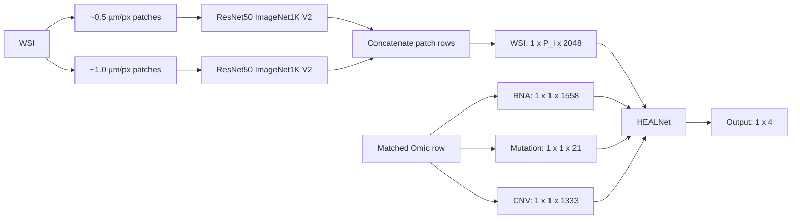

# TCGA-BRCA HEALNet Implementation: Supervisor Progress Report

**Date:** 19 August 2026

**Project stage:** Multiscale engineering pilots completed; cohort execution
and model training not started

**Current compute requirement:** CPU

## 1. Current outcome

We have validated the complete engineering path for three deterministic
TCGA-BRCA patients selected at the 25th, 50th, and 75th percentiles of WSI file
size. For each patient, we verified the exact WSI–Omic identity, generated
two-scale tissue coordinates, extracted ImageNet1K V2 ResNet50 features on a
Tesla T4, and passed a four-modality HEALNet numerical interface test.

The result is a tested preprocessing and model-input contract. It is not yet a
trained model or a survival-prediction result.

## 2. Cohort and input matrix

| Item | Verified value |
|---|---:|
| BRCA Omic rows | 1,022 |
| BRCA patients | 956 |
| Exact WSI–Omic matches | 1,022 |
| Unambiguous singleton patients retained | **894** |
| Multi-WSI patients excluded | 62 |
| Singleton raw WSI inventory | 918.53 GB |
| RNA features | 1,558 |
| Mutation features | 21 |
| CNV features | 1,333 |
| WSI feature width | 2,048 |

Matching uses the exact `(case_id, full slide_id)` pair. No patient is selected
or paired by row order.

## 3. Architecture used

For patient (i):

\[
F_i^{2x}\in\mathbb{R}^{P_i^{2x}\times2048},\qquad
F_i^{4x}\in\mathbb{R}^{P_i^{4x}\times2048},
\]

\[
F_i=\operatorname{cat}(F_i^{2x},F_i^{4x};\mathrm{dim}=0)
\in\mathbb{R}^{P_i\times2048},
\qquad P_i=P_i^{2x}+P_i^{4x}.
\]

The WSI is supplied to HEALNet as `[1,P_i,2048]`. RNA, mutation, and CNV are
kept as three separate modalities. We use batch size one, no padding, and no
attention mask. WSI bags from different patients are never concatenated.

The encoder is torchvision ResNet50 with `IMAGENET1K_V2` weights and the final
classifier removed. This follows the supervisor-aligned engineering plan but
differs from the paper's stated Kather100K pretraining; it should not yet be
called an exact paper reproduction.

## 4. Measured pilot matrix

| Metric | Q25 | Q50 | Q75 |
|---|---:|---:|---:|
| Patient | TCGA-LL-A6FP | TCGA-AR-A1AW | TCGA-E2-A154 |
| Raw WSI size | 648.05 MB | 975.63 MB | 1,360.74 MB |
| Level-0 dimensions | 65,736×67,406 | 99,960×65,334 | 108,528×90,471 |
| Native MPP | 0.2525 | 0.2468 | 0.2468 |
| Effective 2x MPP | 0.5050 | 0.4936 | 0.4936 |
| Effective 4x MPP | 1.0100 | 0.9872 | 0.9872 |
| 2x patch/features | 7,404 | 8,580 | 13,487 |
| 4x patch/features | 1,918 | 2,213 | 3,458 |
| **Total WSI tokens** | **9,322** | **10,793** | **16,945** |
| CPU segmentation + coordinates | 5.92 s | 9.50 s | 31.54 s |
| 2x streaming wall time | 114.43 s | 124.72 s | 181.63 s |
| 4x streaming wall time | 20.26 s | 22.17 s | 31.24 s |
| 2x ResNet forward time | 20.26 s | 24.02 s | 37.58 s |
| 4x ResNet forward time | 5.15 s | 6.33 s | 9.86 s |
| **Complete GPU pilot time** | **155.79 s** | **171.43 s** | **245.16 s** |
| Peak ResNet GPU allocation | 481.3 MB | 481.3 MB | 481.9 MB |
| Feature artifact size | 153.21 MB | 177.40 MB | 278.53 MB |

The streaming wall time includes patch reading, resizing where required, data
loading, and model processing. ResNet forward time is measured inside the
streaming interval and must not be added to it again.

## 5. HEALNet interface results

| Pilot | WSI input | HEALNet output | WSI attention | Result |
|---|---|---|---|---|
| Q25 | `[1,9322,2048]` | `[1,4]` | `[1,2,9322]` | finite |
| Q50 | `[1,10793,2048]` | `[1,4]` | `[1,2,10793]` | finite |
| Q75 | `[1,16945,2048]` | `[1,4]` | `[1,2,16945]` | finite |

Each Omic modality produced attention shape `[1,2,1]`. Synthetic-input and
real-feature tests were finite for every pilot. HEALNet was randomly initialized
and run only in evaluation mode. Training runs, backward passes, and optimizer
steps remain zero.

## 6. GPU timing issue and interpretation

The measured GPU job time increases with the number of accepted WSI patches:

- Q25: 9,322 tokens in 155.79 seconds;
- Q50: 10,793 tokens in 171.43 seconds; and
- Q75: 16,945 tokens in 245.16 seconds.

This scaling is expected. The dominant cost is WSI streaming, patch decoding,
and preprocessing rather than GPU memory. Peak ResNet allocation remained
approximately 482 MB on a 15 GB Tesla T4.

There are two operational timing concerns:

1. Q75 had one conversation-session interruption before publication. That
   attempt left no artifact, lock, staging directory, or active process. The
   controlled retry completed successfully in 245.16 seconds. This was an
   orchestration/session interruption, not a model or data-integrity failure.
2. GPU attachment is not persistent when the Studio is returned to CPU mode.
   A new GPU session requires a fresh CUDA/driver preflight. For cohort work,
   we need guidance on whether to reserve a continuous GPU window or run
   separately authorized batches with restart checkpoints.

Using the three complete pilot times, the mean is 190.79 seconds per patient.
Naive scaling to 894 patients gives:

\[
T_{mean}=\frac{894\times190.79}{3600}=47.38\text{ T4 GPU-hours}.
\]

The observed minimum-to-maximum scenario is approximately **38.69–60.88 T4
GPU-hours**. Allowing for download, CPU coordinate generation, validation,
queueing, and interruptions, expected sequential wall time is approximately
**2–4 days**. This is an engineering estimate based on three pilots, not a
statistical confidence interval.

## 7. Storage result

The pilot format stores both branch tensors and their combined duplicate.
Projected across 894 patients, that format could require 136.97–249.00 GB and
is unsafe under the 200 GB Lightning quota.

We have therefore implemented and synthetically validated a compact four-file
format containing one canonical combined tensor, row provenance, manifest, and
checksum. Its pilot-scaled storage scenarios are:

| Scenario | Projected compact cohort storage |
|---|---:|
| Q25 observed rate | 68.69 GB |
| Mean pilot rate | 91.05 GB |
| Q75 observed rate | 124.90 GB |

An immutable SHA256-linked recovery ledger and a 20 GB storage safety floor
have also been implemented. No real pilot artifacts were modified or migrated.

## 8. Work completed

- Exact 894-patient singleton alignment and Omic contract.
- Physical-scale policy for approximately 0.5 and 1.0 µm/px branches.
- CPU tissue segmentation and coordinate generation for Q25/Q50/Q75.
- Tesla T4 ResNet50 feature extraction for Q25/Q50/Q75.
- Four-modality HEALNet synthetic and real-feature numerical smoke tests.
- Atomic artifact publication, checksums, and row-level provenance.
- Compact cohort artifact schema and append-only recovery ledger.
- 647 passing repository tests.

## 9. Work remaining

1. CPU-only compatibility rehearsal of the compact format against the frozen
   Q25/Q50/Q75 artifacts.
2. Define an exact small-batch cohort manifest and stopping rules.
3. Obtain authorization for acquisition, pixel access, GPU extraction, and raw
   data lifecycle for that batch.
4. Execute and audit the small batch before considering all 894 patients.
5. Perform full-cohort feature extraction if approved.
6. Complete patient-level quality control and leakage-safe data splitting.
7. Freeze the outcome, censoring, loss, training, and evaluation protocol.
8. Obtain separate training authorization, then train and evaluate HEALNet.

GPU is not needed for item 1 or the small-batch design. It becomes necessary
again only for authorized ResNet50 extraction and later HEALNet training.

## 10. Guidance requested

Supervisor guidance is requested on the following decisions:

1. Should the next execution be a small validation batch before all 894
   patients? We recommend a small batch.
2. Should GPU processing use one continuous reserved window or restartable
   batches, given the estimated 39–61 T4 GPU-hours and session interruptions?
3. Is the compact single-tensor artifact format acceptable for cohort
   retention, with branch membership preserved by row ranges and provenance?
4. What raw WSI retention or deletion policy should be used after verified
   feature publication? No deletion is currently authorized.
5. Should ImageNet1K V2 remain the engineering encoder, or is Kather100K
   pretraining required before the scientific study is presented as a paper
   reproduction?
6. What train/validation/test and survival-evaluation protocol should be frozen
   before training?

## 11. Current conclusion

The BRCA preprocessing and four-input HEALNet interface are engineering-
validated across three deterministic WSI-size pilots. The main remaining risks
are operational scaling, storage lifecycle, and the not-yet-defined scientific
training/evaluation protocol. No survival-performance claim can be made until
the cohort is processed and HEALNet is trained and evaluated.
