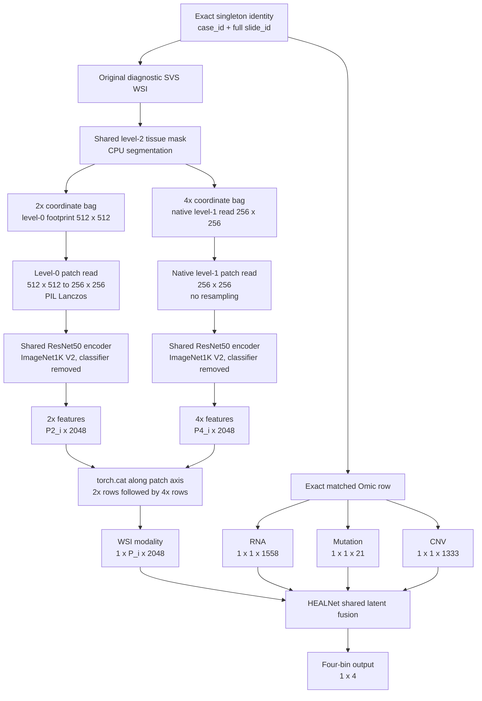
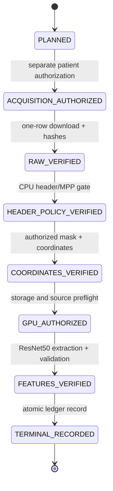

# Supervisor Progress Report: HEALNet BRCA Multimodal Implementation

**Project:** Supervisor-aligned HEALNet implementation for TCGA-BRCA

**Reporting date:** 19 August 2026

**Current phase:** Three-patient engineering validation completed; cohort-scale
streaming and storage design in progress

**Current compute requirement:** CPU only

**Training status:** Not started and not yet authorized

---

## 1. Executive summary

The project has completed the main engineering-risk reduction phase for a
multimodal HEALNet pipeline combining whole-slide histology with RNA,
mutation, and copy-number variation data. We established an exact
patient/slide alignment for TCGA-BRCA, selected three deterministic singleton
patients representing the 25th, 50th, and 75th percentiles of WSI file size,
and successfully processed all three through:

1. exact raw-data identity and integrity validation;
2. physical-resolution and pyramid-geometry validation;
3. tissue segmentation and two-scale coordinate generation;
4. ImageNet1K V2 ResNet50 patch-feature extraction on a Tesla T4;
5. atomic, hash-verified artifact publication; and
6. synthetic and real-feature four-modality HEALNet numerical smoke tests.

The three pilots produced 9,322, 10,793, and 16,945 WSI feature tokens,
respectively. Each yielded a finite HEALNet output of shape `[1,4]` and the
expected attention shapes. These are engineering interface tests using a
randomly initialized HEALNet, not trained survival predictions.

The extraction interface is now sufficiently validated to freeze for the
observed pilot range. The immediate remaining task is to finalize a compact
per-patient artifact format and recovery ledger. GPU resources are **not
required for this current design task**. A GPU becomes necessary again when a
separately authorized cohort extraction batch begins.

---

## 2. Research objective and scope

The engineering objective is to prepare a reproducible patient-level pipeline
in which each BRCA sample contains four distinct modalities:

- a variable-length multiscale WSI feature bag;
- RNA expression;
- somatic mutation features; and
- copy-number variation features.

The work follows the supervisor-defined multimodal architecture while keeping
deviations from the paper and released repository explicit. In particular,
the current encoder uses torchvision `ResNet50_Weights.IMAGENET1K_V2`, whereas
the paper describes Kather100K pretraining. Therefore, this is a
supervisor-aligned engineering implementation and must not yet be described as
an exact reproduction of every preprocessing choice in the paper.

The current project scope does **not** include a scientific claim, a trained
model, survival prediction, full-cohort processing, or final performance
metrics.

---

## 3. System architecture

### 3.1 Patient-level multimodal architecture

There is no direct concatenation of WSI values with Omic values. The four
modalities enter HEALNet separately and interact through the shared latent
attention mechanism.

### 3.2 Tensor mathematics

For patient (i), let (P_i^{(2)}) and (P_i^{(4)}) denote the retained patch
counts at the two physical-scale branches. The classifier-removed ResNet50
produces one 2,048-dimensional vector per patch:

\[
F_i^{(2)} \in \mathbb{R}^{P_i^{(2)} \times 2048}, \qquad
F_i^{(4)} \in \mathbb{R}^{P_i^{(4)} \times 2048}.
\]

The branches are combined only along the patch axis:

\[
F_i = \operatorname{cat}\left(F_i^{(2)}, F_i^{(4)};\,\mathrm{dim}=0\right)
\in \mathbb{R}^{P_i \times 2048},
\]

where

\[
P_i = P_i^{(2)} + P_i^{(4)}.
\]

The HEALNet inputs for batch size one are:

\[
X_i^{WSI} \in \mathbb{R}^{1 \times P_i \times 2048},
\]

\[
X_i^{RNA} \in \mathbb{R}^{1 \times 1 \times 1558}, \quad
X_i^{MUT} \in \mathbb{R}^{1 \times 1 \times 21}, \quad
X_i^{CNV} \in \mathbb{R}^{1 \times 1 \times 1333}.
\]

No WSI pooling or transpose is performed. Consequently, the WSI channel
dimension is 2,048 and the WSI attention length is the patient-specific patch
count (P_i). The initial pipeline uses batch size one without padding or an
attention mask. The cohort is a ragged collection

\[
\mathcal{D}_{WSI} = \{F_i\}_{i=1}^{S}, \qquad S=894,
\]

not one rectangular cross-patient tensor.

---

## 4. Data alignment and cohort definition completed

The official BRCA Omic archive and filtered WSI manifest were aligned using
the exact literal pair `(case_id, slide_id)`. Row order, normalized filenames,
and case-only matching are prohibited.

| Alignment measure | Verified result |
|---|---:|
| Omic rows | 1,022 |
| Omic patients | 956 |
| Filtered-manifest WSI rows | 1,022 |
| Exact case-plus-slide matches | 1,022 |
| Singleton patients retained | **894** |
| Multi-WSI patients excluded | 62 |
| WSI-only or Omic-only patients | 0 |

The 894 singleton WSIs have a manifest-declared raw size of
918,532,189,383 bytes (918.53 GB decimal). Their individual sizes range from
25,565,706 to 3,401,266,790 bytes, with a median of 974,485,171 bytes.

The three engineering pilots were deterministically selected at the nearest
observed 25th, 50th, and 75th percentile ranks of the 894 singleton WSI sizes.

---

## 5. Multiscale physical-resolution policy completed

The branch names `scale_2x` and `scale_4x` describe target physical sampling
and are not assumed to equal fixed OpenSlide level numbers for every slide.

For the three verified Aperio pilot slides, native base resolution was close
to 0.25 micrometres per pixel. The frozen pilot mapping is:

| Branch | Physical target | Source | Source footprint | Encoder input | Resampling |
|---|---:|---|---:|---:|---|
| `scale_2x` | approximately 0.5 µm/px | level 0 | 512×512 | 256×256 | PIL Lanczos |
| `scale_4x` | approximately 1.0 µm/px | native level near 1.0 µm/px | 256×256 | 256×256 | none |

Each future slide must still pass an independent metadata gate. Missing MPP,
unsupported pyramid geometry, scale error outside the frozen tolerance, or an
ambiguous level mapping must fail closed; the pilot mapping cannot be copied
blindly to a geometrically incompatible slide.

---

## 6. Completed three-patient engineering pilots

### 6.1 Identity and WSI geometry

| Pilot | Patient | Raw WSI bytes | Level-0 dimensions | Native MPP |
|---|---|---:|---:|---:|
| Q25 | `TCGA-LL-A6FP` | 648,046,947 | 65,736×67,406 | 0.2525×0.2525 |
| Q50 | `TCGA-AR-A1AW` | 975,626,387 | 99,960×65,334 | 0.2468×0.2468 |
| Q75 | `TCGA-E2-A154` | 1,360,743,825 | 108,528×90,471 | 0.2468×0.2468 |

Every pilot was bound to an exact GDC UUID, filename, byte size, MD5, SHA256,
patient identity, full slide identity, Omic row, coordinate manifest, and
ResNet50 checkpoint. Inputs were revalidated before publication.

### 6.2 Coordinate and feature metrics

| Metric | Q25 | Q50 | Q75 |
|---|---:|---:|---:|
| Segmentation + coordinate generation | 5.92 s | 9.50 s | 31.54 s |
| 2x coordinates/features | 7,404 | 8,580 | 13,487 |
| 4x coordinates/features | 1,918 | 2,213 | 3,458 |
| Total feature tokens | **9,322** | **10,793** | **16,945** |
| 2x streaming time | 114.43 s | 124.72 s | 181.63 s |
| 4x streaming time | 20.26 s | 22.17 s | 31.24 s |
| 2x ResNet forward time | 20.26 s | 24.02 s | 37.58 s |
| 4x ResNet forward time | 5.15 s | 6.33 s | 9.86 s |
| Total GPU pilot runtime | **155.79 s** | **171.43 s** | **245.16 s** |
| Peak ResNet GPU allocation | 481,334,784 B | 481,334,784 B | 481,859,072 B |
| Published feature artifacts | 153,208,853 B | 177,402,321 B | 278,525,034 B |

The recorded branch streaming time includes data loading, slide reads,
resampling where required, and model processing; the model-forward counters
are instrumentation within that branch rather than additional wall time.

### 6.3 HEALNet smoke-test metrics

| Pilot | WSI input | Output | WSI attention | Omic attentions | Result |
|---|---|---|---|---|---|
| Q25 | `[1,9322,2048]` | `[1,4]` | `[1,2,9322]` | three × `[1,2,1]` | finite |
| Q50 | `[1,10793,2048]` | `[1,4]` | `[1,2,10793]` | three × `[1,2,1]` | finite |
| Q75 | `[1,16945,2048]` | `[1,4]` | `[1,2,16945]` | three × `[1,2,1]` | finite |

Both a zero-valued synthetic WSI-interface check and a real extracted-feature
check were executed for each patient. All outputs and attention tensors were
finite. HEALNet was randomly initialized and used in evaluation/inference
mode; no loss, backward pass, optimizer step, checkpoint, or scientific
prediction was produced.

---

## 7. Reproducibility, validation, and safety controls completed

The implementation currently includes:

- deterministic CUDA settings using `CUBLAS_WORKSPACE_CONFIG=:4096:8`;
- deterministic PyTorch and cuDNN algorithms;
- TF32, automatic mixed precision, and CPU fallback disabled for pilots;
- fixed branch order: 2x followed by 4x;
- exact row provenance linking every feature to branch and coordinate;
- atomic, no-overwrite artifact publication;
- SHA256 sidecars and independent post-publication validation;
- retained raw WSIs with zero deletion operations;
- no Google Drive operations;
- no modification of the official HEALNet checkout or frozen BLCA reference;
- fail-closed authorization gates for every destructive or pixel-capable
  transition; and
- 635 passing repository tests after the cohort streaming design was added.

The Q75 GPU result was committed at `f4e83ba`, and the frozen singleton
streaming policy was committed at `b555066`.

---

## 8. Cohort-scale streaming architecture designed

The Lightning persistent-storage quota is 200,000,000,000 bytes, while the raw
singleton cohort is approximately 918.53 GB. Therefore, the complete cohort
cannot be downloaded and retained at once.

Only after the current patient reaches `TERMINAL_RECORDED` may the next
patient transaction be considered. The design fixes download, extraction, and
model batch concurrency to one. It retains at most one active raw WSI, stores
no patch images, preserves a 20 GB storage safety floor, and stops the queue on
any mismatch or incomplete state.

The current code for this state machine is pure planning logic. It has no
filesystem, network, OpenSlide, Torch, CUDA, or training interface and therefore
cannot accidentally begin cohort execution.

---

## 9. Runtime and storage projections

### 9.1 GPU time

Let the measured complete pilot GPU times be

\[
t = \{155.7917,\ 171.4287,\ 245.1573\}\ \text{seconds}.
\]

The observed mean is

\[
\bar{t} = \frac{1}{3}\sum_{j=1}^{3} t_j = 190.7926\ \text{seconds/patient}.
\]

For 894 singleton patients, naive scaling gives

\[
T_{GPU,mean} = \frac{894\bar{t}}{3600} = 47.38\ \text{T4 GPU-hours}.
\]

Scaling the observed minimum and maximum yields a planning interval of
approximately **38.69–60.88 T4 GPU-hours**. This is not a statistical
confidence interval; it is an engineering scenario based on only three
deterministically selected pilots. It excludes network delays, CPU metadata
gates, queue interruptions, retries, and future training.

Practical wall-clock expectation for sequential cohort preprocessing is
approximately **2–4 days**, depending mainly on GDC transfer speed, slide I/O,
coordinate density, GPU availability, and operator-approved lifecycle steps.

### 9.2 Artifact storage

The pilot artifact layout permanently stores both branch tensors and their
combined duplicate. Scaling that layout gives:

| Scenario | Projected 894-patient artifact bytes |
|---|---:|
| Observed minimum per-patient layout | 136,968,714,582 |
| Observed mean per-patient layout | 181,522,589,984 |
| Observed maximum per-patient layout | 249,001,380,396 |

The upper scenario exceeds the 200 GB quota, and the mean leaves insufficient
headroom after the mandatory 20 GB safety floor. A compact schema should retain
one canonical combined tensor plus branch-boundary metadata and row provenance,
instead of retaining three numerically duplicate tensor files. Based on the
pilot token counts, a preliminary compact tensor-only scenario is roughly
68–125 GB before metadata and operational reserves. The exact compact format
must be implemented and validated before cohort extraction is authorized.

---

## 10. Progress assessment

Progress depends on whether the denominator is the engineering pilot or the
complete scientific study. The following phase-level view avoids presenting a
misleading single percentage.

| Workstream | Progress | Evidence/status |
|---|---:|---|
| BRCA source alignment and singleton definition | 100% | 894 exact singleton patients verified |
| Multiscale coordinate and extraction policy | 100% | Q25/Q50/Q75 validated |
| Three-patient CPU/GPU engineering pilots | 100% | all three successful |
| HEALNet four-modality interface validation | 100% | synthetic and real-feature smoke tests pass |
| Cohort streaming architecture | approximately 75% | state machine designed; compact schema pending |
| Full 894-patient feature extraction | 0% | not authorized or started |
| Patient-level QC and data splitting | design stage | must precede training |
| HEALNet training and evaluation | 0% | not authorized or started |

The preprocessing engineering foundation is mature. Relative to the entire
project through trained-model evaluation, overall progress is approximately
**35–40%**. This is a project-management estimate, not an experimental metric.

---

## 11. Work remaining and decision gates

### Immediate CPU-only work

1. Specify the compact patient artifact schema.
2. Define branch boundaries without duplicate tensor retention.
3. Implement strict compact-artifact publication and validation.
4. Implement the append-only transaction/recovery ledger.
5. Test interruption, resume, collision, low-space, and hash-drift behavior
   using synthetic inputs.
6. Prepare a separately reviewable small-batch execution proposal.

Estimated engineering time for this immediate design-and-test package is
approximately **1–3 focused working hours**, subject to review findings.

### Before cohort GPU work

The following require explicit review and authorization:

- the compact artifact and recovery-ledger contract;
- the exact patient batch or cohort manifest;
- acquisition concurrency and storage preflight;
- raw WSI retention or deletion policy;
- any archival destination and credential boundary; and
- the GPU execution boundary.

A small staged batch is recommended before committing to all 894 patients.

### After feature extraction

1. Validate cohort completeness, hashes, modality availability, and patch-count
   distributions.
2. Construct leakage-safe train/validation/test partitions grouped by patient.
3. Freeze outcome encoding, censoring policy, loss function, model
   hyperparameters, evaluation metrics, and random seeds.
4. Obtain separate authorization for training.
5. Train HEALNet and report survival metrics, calibration, uncertainty,
   ablations, and reproducibility evidence.

Training duration cannot yet be estimated responsibly because the training
schedule, number of epochs, cross-validation plan, model size, early stopping,
and evaluation protocol have not been frozen.

---

## 12. When GPU resources are required

GPU resources are **not required now**. The current compact-artifact and ledger
work is CPU-only.

The next GPU requirement occurs only after:

1. the compact schema and recovery ledger pass CPU review;
2. an exact extraction batch is approved;
3. the required raw data and coordinates pass their individual CPU gates; and
4. a fresh deterministic CUDA preflight passes.

At that point, a Tesla T4-class GPU is sufficient based on the three pilots.
Peak measured ResNet allocation was approximately 482 MB, well below the
15,360 MiB T4 capacity. The workload is dominated more by slide streaming and
patch preparation than by GPU memory capacity.

---

## 13. Current scientific interpretation

The project has demonstrated a reproducible and numerically stable multimodal
data path from exact BRCA patient identity through multiscale WSI encoding and
four-input HEALNet inference. It has **not** demonstrated clinical validity,
survival-prediction performance, generalization, or superiority over a
baseline. Those questions belong to the later, separately designed training
and evaluation phase.

The appropriate current conclusion is:

> **The BRCA multimodal preprocessing and HEALNet interface are engineering-
> validated across three deterministic WSI-size pilots. Cohort-scale compact
> storage, extraction execution, and scientific training remain pending.**
