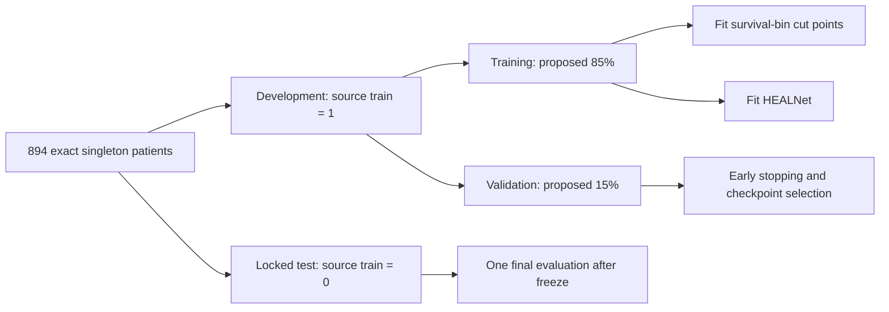

# TCGA-BRCA HEALNet pre-training scientific protocol — draft

Status: `DRAFT_REVIEW_REQUIRED_TRAINING_NOT_AUTHORIZED`

This document defines the scientific decisions that must be frozen before any
HEALNet training. It is a CPU-authored protocol based exclusively on the local
894-patient alignment, the local BRCA Omic archive, the supervisor tensor
contract, and the official HEALNet `v0.1.0` source at commit
`28ba5da6ab99fd8069972c22e986d83edb658dd4`. It does not authorize or perform
cohort processing, model execution, GPU work, or training.

## 1. Study identity and permitted claim

The primary study is the **supervisor-aligned engineering implementation**:

- frozen classifier-removed torchvision ResNet50;
- `ResNet50_Weights.IMAGENET1K_V2` checkpoint, SHA256
  `11ad3fa62ca79e40addfd354a8ec4b7c75143b3038b8d2a807fbc68deab379ca`;
- two WSI branches near 0.5 and 1.0 µm/px, concatenated 2× rows then 4× rows;
- WSI, RNA, mutation, and CNV supplied as four separate HEALNet modalities;
- patient-local variable-length WSI bags and batch size one.

The encoder remains frozen during HEALNet training. Existing feature tensors
are inputs; training must not fine-tune ResNet50 or re-open WSIs.

This is not an exact reproduction of the paper. The paper-faithful track
requires an authoritatively identified Kather100K-pretrained ResNet50 checkpoint
and physical-resolution provenance. Those remain unresolved, and ImageNet1K V2
must not be silently substituted in that track. Every result must disclose the
encoder and four-modality engineering differences.

## 2. Verified cohort and outcome data

The alignment retains 894 unique singleton patients and 894 unique slides from
1,022 Omic rows. Matching is the exact literal pair `(case_id, slide_id)`; 62
ambiguous multi-WSI patients remain excluded. No retained patient or slide is
duplicated.

For all 894 retained patients, the locally verified source contains:

| Field | Verified result |
|---|---:|
| `survival_months` missing/nonfinite | 0 / 0 |
| `censorship` missing/nonfinite | 0 / 0 |
| Observed events (`censorship=0`) | 126 |
| Right-censored (`censorship=1`) | 768 |
| Censored fraction | 85.91% |
| Survival range | 0.03–282.69 months |
| Median follow-up/time value | 30.98 months |
| RNA width; missing/nonfinite | 1,558; 0 / 0 |
| Mutation width; missing/nonfinite | 21; 0 / 0 |
| CNV width; missing/nonfinite | 1,333; 0 / 0 |

The endpoint is conservatively named the **source-defined time-to-event
endpoint**. The source columns are `survival_months` and `censorship`; the event
indicator is

\[
\delta_i = 1-c_i,
\]

where (c_i=0) denotes an observed event and (c_i=1) denotes right
censoring. The project must not relabel this as overall, disease-specific, or
progression-free survival until the supervisor confirms the intended clinical
endpoint and its source provenance.

The high censoring rate makes leakage control, event balance, uncertainty
reporting, and censoring-aware secondary metrics essential.

## 3. Leakage-safe patient partition

The preferred draft preserves the source archive's existing outer partition:

| Partition source | Patients | Events | Censored |
|---|---:|---:|---:|
| `train=1`: development | 776 | 93 | 683 |
| `train=0`: locked test | 118 | 33 | 85 |

Only the 776 development patients would be divided into training and validation
sets. The proposed split is 85:15, deterministic seed `20260820`, stratified by
censoring with a survival-distribution balance check. The exact patient list
must be materialized once in a hashed manifest before training. Approximate
counts are 660 training and 116 validation patients, but the manifest—not an
estimate—will be authoritative.

Mandatory safeguards are:

1. A patient and all of that patient's WSI rows and Omic inputs appear in one
   partition only.
2. No test patient contributes to imputation, scaling, time-bin cut points,
   hyperparameter selection, early stopping, or checkpoint selection.
3. No fold or model is selected by test C-index. The official released source's
   test-based best-fold selection must not be carried into this study.
4. The locked test set is evaluated once after the analysis and checkpoint are
   frozen.
5. Any replacement with fresh cross-validation or repeated splits changes the
   comparison basis and requires supervisor approval.

## 4. Training-only survival discretization

HEALNet produces four logits, corresponding to four discrete time intervals.
Let (b_1,b_2,b_3) be the 25th, 50th, and 75th percentiles of
`survival_months` among **observed-event patients in the final training
partition only**. The intervals are

\[
(-\infty,b_1),\quad [b_1,b_2),\quad [b_2,b_3),\quad [b_3,+\infty).
\]

The same frozen cut points are then applied to validation and test patients.
This hardens the released loader, which constructs bins before random splitting
and therefore can expose held-out outcome distributions. Duplicate or
nonfinite internal cut points, invalid endpoints, or an empty training bin must
fail closed.

The observed whole-cohort event quartiles are deliberately not used as model
cut points; they were inspected only as a metadata diagnostic. The final values
do not exist until the split is approved and materialized.

## 5. Model and multimodal input contract

For patient (i), HEALNet receives:

\[
X_i^{WSI}\in\mathbb{R}^{1\times P_i\times 2048},\quad
X_i^{RNA}\in\mathbb{R}^{1\times1\times1558},
\]

\[
X_i^{MUT}\in\mathbb{R}^{1\times1\times21},\quad
X_i^{CNV}\in\mathbb{R}^{1\times1\times1333}.
\]

The fixed modality order is WSI, RNA, mutation, CNV. There is no WSI–Omic
concatenation, cross-patient patch concatenation, global WSI pooling, padding,
or attention mask in the initial training protocol. Patient batch size is one
because (P_i) is variable.

The candidate HEALNet architecture is the released BRCA entry from
`config/best_hyperparams.yml`: depth 2, 17 latents, latent dimension 126,
cross-head dimension 63, latent-head dimension 20, attention dropout
0.4552692654, feed-forward dropout 0.3647413444, and four output logits. These
values were optimized for the released input path, not this four-separate-
modality adaptation, so their use requires explicit supervisor approval rather
than being assumed paper-exact.

## 6. Discrete survival model and loss

For output logit (z_{ik}) in interval (k\in\{0,1,2,3\}), define

\[
h_{ik}=\sigma(z_{ik}),\qquad
S_{ik}=\prod_{j=0}^{k}(1-h_{ij}),\qquad
r_i=-\sum_{k=0}^{3}S_{ik}.
\]

Here (h_{ik}) is the discrete hazard, (S_{ik}) the predicted survival, and
(r_i) the scalar risk used by the released C-index path.

The proposed primary loss is the released v0.1.0 discrete-time negative
log-likelihood with `alpha=0.4` and numerical floor (10^{-7}). If patient
(i) is observed in interval (Y_i), its likelihood contribution uses
survival through the preceding interval and hazard in (Y_i). If censored in
(Y_i), it uses survival through that interval. In compact form,

\[
\ell_i^{event}=-\left[\log S_i(Y_i-1)+\log h_i(Y_i)\right],
\]

\[
\ell_i^{cens}=-\log S_i(Y_i),\qquad
\ell_i=(1-\alpha)\left(\ell_i^{event}+\ell_i^{cens}\right)
        +\alpha\ell_i^{event}.
\]

The recommended draft uses no bin weighting. The released configuration asks
for inverse bin weights while its comment states class weights are irrelevant
to survival; this inconsistency must be resolved by the supervisor. If weights
are chosen, they must be computed from training patients only and frozen in
provenance.

## 7. Training and checkpoint-selection candidate

The released-code candidate is Adam, learning rate
`0.007765016508403882`, OneCycleLR with maximum learning rate `0.008`, at most
50 epochs, and early stopping on validation NLL with patience 5. The best
validation-loss weights must be restored. Test loss or C-index must never drive
early stopping.

These values are not executable approval. Gradient accumulation, precision
mode, exact deterministic settings, and runtime recovery behavior remain to be
frozen after the batch-one training runner is CPU-rehearsed. A misleading
"gradient accumulation" implementation that steps the optimizer every patient
must not be accepted as accumulation.

## 8. Evaluation and reporting

The primary endpoint metric is Harrell's concordance index on the locked test
set:

\[
\widehat C=
\Pr(r_i>r_j\mid T_i<T_j,\;i\text{ is an observed comparable event}).
\]

The candidate implementation is
`sksurv.metrics.concordance_index_censored`, with event indicator
`censorship==0`, continuous time `survival_months`, risk
(-\sum_k S_k), and tied tolerance (10^{-8}).

Required final reporting includes:

- locked-test C-index and the number of comparable pairs;
- patient-bootstrap 95% confidence interval (proposed 2,000 replicates, seed
  `20260821`) and the number of non-estimable bootstrap replicates;
- validation NLL at the selected checkpoint and locked-test NLL;
- patient/event/censoring counts in every partition;
- all predetermined exclusions and failures.

Secondary censoring-aware analyses should include IPCW C-index, cumulative
dynamic AUC, integrated Brier score, and calibration if estimable. Evaluation
horizons and the supported follow-up range must be chosen from training data
only and frozen before held-out evaluation. High censoring and limited events
must be stated alongside every metric.

If multiple prespecified folds are ultimately approved, report all folds and
their mean and dispersion. Do not report only the best test fold.

## 9. Reproducibility record

Every authorized run must preserve:

- exact eligible-cohort and split manifests with SHA256 hashes;
- endpoint audit and training-derived bin cut points;
- every patient compact-artifact manifest hash;
- ImageNet1K V2 checkpoint identity;
- official HEALNet tag, commit, and model-source hash;
- project training code commit and executable file hashes;
- seeds, deterministic settings, environment, driver, CUDA and GPU identity;
- optimizer, scheduler, full hyperparameters and epoch history;
- selected checkpoint SHA256;
- patient-level logits, hazards, survival, scalar risks, times, censoring and
  metric inputs required to reproduce evaluation.

WSI preprocessing must remain outcome-blind. Any additional Omic imputation or
normalization must be fitted on training patients and applied unchanged to
validation and test data.

## 10. Comparison language

Permitted claims are limited to performance of the supervisor-aligned
ImageNet1K V2 engineering implementation and within-protocol ablations on
identical patient splits. Published HEALNet numbers may be shown as clearly
labeled context only when endpoint, cohort, preprocessing, split, encoder,
modalities and metric implementation are compared explicitly.

Prohibited claims include "exact paper reproduction," encoder equivalence
between ImageNet1K V2 and Kather100K, or attributing any performance difference
solely to HEALNet architecture. The required disclosure is:

> Results use frozen ImageNet1K V2 ResNet50 features and a four-modality
> supervisor-aligned input contract. The paper-faithful Kather100K track remains
> unresolved and was not executed.

## 11. Decisions required from the supervisor

1. Confirm that `survival_months`/`censorship` represents the intended clinical
   endpoint and approve its scientific name.
2. Approve the source `train` column as the locked outer test boundary, or
   request a different patient-level split/cross-validation design.
3. Approve the proposed 85:15 development train/validation split and seeds.
4. Select unweighted NLL or the released inverse-bin weighting behavior.
5. Approve the released BRCA HEALNet hyperparameters for four separate
   modalities, or authorize tuning within the development set.
6. Freeze optimizer, accumulation, precision, confidence intervals, secondary
   metrics and evaluation horizons.
7. Decide whether a separate Kather100K paper-faithful experiment is required.

## 12. Closed training gate

Training remains prohibited until all cohort feature artifacts and exclusions
are frozen; the supervisor approves the endpoint, split, loss, model and metric
protocol; the split manifest and training-only cut points are generated and
hashed; a fail-closed runner is CPU-rehearsed; runtime and recovery policy is
approved; and separate explicit training authorization is recorded.

No WSI was opened, no GPU/CUDA or model operation was run, and no training,
backward pass, optimizer step, test evaluation, deletion, or Drive operation
was performed to prepare this draft.
